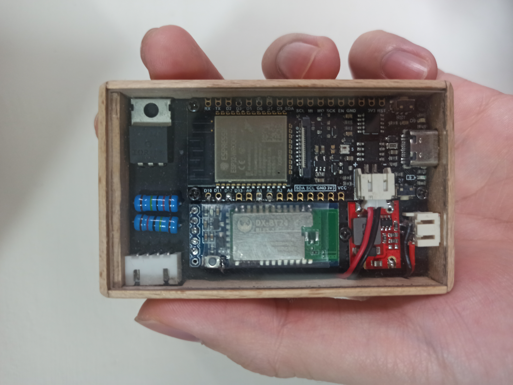

# IOT-Power-Bank

## 專案簡介
IOT-Power-Bank 是一款專為 IoT 裝置設計的低功耗智慧電源管理模組，支援週期性供電、藍牙喚醒與電量查詢，適合長時間運作且需遠端管理的應用場景。

## 特色功能
- **週期性供電**：可自訂間隔時間與每次工作時間，延長電池壽命。
- **超低待機功耗**：待機電流約 40µA，一顆 18650 電池理論可待機約 9 年。
- **電量查詢**：可透過指令查詢剩餘電量，方便遠端監控。
- **藍牙喚醒與控制**：支援藍牙喚醒裝置並傳送控制指令。
- **多種通訊介面**：提供 XH2.54 與 USB 介面，支援 UART 通訊，方便與各類 IoT 裝置整合。

## 元件清單
- ESP32: FireBeetle 2 ESP32-E 
- BLE: BT24
- MOSFET: IRFZ44N
- 1.2M 電阻
- 330K 電阻
- 18650 鋰電池

## 指令說明

| 指令                | 說明                                         | 範例/格式           |
|---------------------|----------------------------------------------|---------------------|
| AT+...              | 轉發 AT 指令至藍芽模組                       | `AT+NAME?`          |
| esp_sleep           | 進入深度睡眠                                 | `esp_sleep`         |
| ble_disconnection   | 斷開藍芽連線                                 | `ble_disconnection` |
| batt                | 查詢電池電壓與剩餘電量                       | `batt`              |
| power_on            | 啟動供電（MOSFET導通，對外供電）              | `power_on`          |
| power_off           | 關閉供電（MOSFET關斷，停止對外供電）          | `power_off`         |
| period              | 查詢目前供電週期（單位：秒）                  | `period`            |
| period=數值         | 設定供電週期（單位：秒，0 表示不進入睡眠）    | `period=60`         |
| worktime            | 查詢目前每次供電持續時間（單位：秒）                  | `worktime`          |
| worktime=數值       | 設定每次供電持續時間（單位：秒，0 表示無限）  | `worktime=10`       |
| no_wakeup           | 查詢永久睡眠設定（1: 永久睡眠, 0: 關閉）      | `no_wakeup`         |
| no_wakeup=數值      | 設定永久睡眠（1: 永久睡眠, 0: 關閉）          | `no_wakeup=1`       |
| fwd=指令            | 透過藍芽轉送指令給外接模組                    | `fwd=AT+TEST`       |
